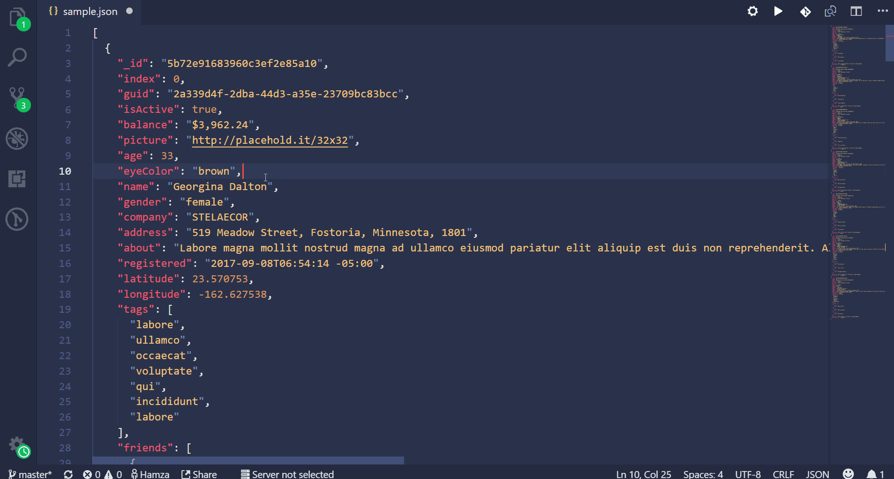

     

I made this plugin so that I can share files using hastebin server (https://hastebin.com/)

You can install the plugin from the [VSCode marketPlace](https://marketplace.visualstudio.com/items?itemName=HamzaAnis.vscode-to-hastebin)

## Features

 -  You can share the code using shortcut key `ctrl+alt+h`

 - You can also share the code by typing `Hastebin` in `Ctrl+Shift+P`

<!-- \!\[feature X\]\(images/feature-x.png\) -->

### Setting
From the setting you can use the configuration to change the hastebin host using this property `vscode-to-hastebin.server`

| Name | Description |
| ---- | --------- |
|`host`|`this lets you change the hastebin server`|

If you want to improve this extension then feel free to create a PR and if there is some issue in the extension then please open the issue on [Github](https://github.com/HamzaAnis/vscode-to-hastebin/issues)

### Changelog
[Changelog](/CHANGELOG.md)

**Enjoy!**

### Contributors
[Jacob Birkett](https://github.com/spikespaz)

[Wojciech Polus](https://github.com/wopol)
